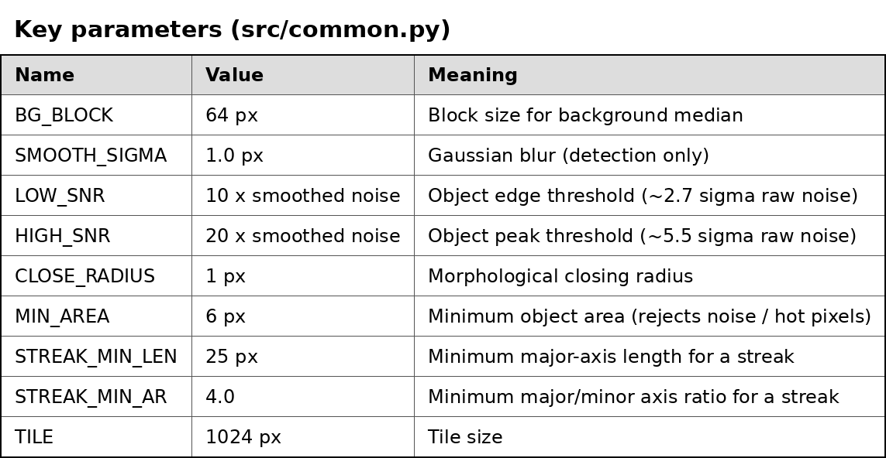

# SSA Star / Streak Annotation Pipeline

Segments stars (blobs) and satellite streaks in single band 16-bit FITS images and exports
YOLO Ultralytics segmentation labels.

Pipeline: FITS -> background subtraction -> per image noise normalisation -> detection on the
full image -> star/streak classification -> 1024x1024 tiles -> YOLO-seg labels -> repatched
full-size overlay for visual inspection.

## Setup

```bash
pip install -r requirements.txt
```

Put the 10 FITS files in `data/raw/`.

## Run (from the project root)

```bash
python src/01_check_fits.py                                  # shape, range, noise per image
python src/02_tune_preview.py data/raw/<file>.fits 3 4       # preview of one tile (row 3, col 4)
python src/03_tile_and_label.py                              # tiles + YOLO labels
python src/04_repatch.py                                     # full-size overlays
python src/08_streak_check.py                                # side-by-side check of streak tiles
```

`05_sweep.py`, `09_tile_stats.py` are helper scripts used for threshold selection and debugging.

## Output

```
output/dataset/images/   700 tiles, 1024x1024 PNG (name: imageN_rRR_cCC.png)
output/dataset/labels/   700 YOLO segmentation .txt files
output/dataset/data.yaml
output/repatched_full/   full-size (9568x6380) clean image + overlay
output/summary.csv       objects per image
```

## Classes

0 = star (blob), 1 = streak

## Method (short)

- Background: 64x64 block median, smoothed, subtracted.
- Noise: 1.4826 x MAD per image (percentile fallback when MAD is ~0, e.g. quantised 12-bit images).
- Detection: 1 px Gaussian blur, hysteresis threshold, closing, connected components.
- Streak = major axis >= 25 px and major/minor >= 4, otherwise star.
- Tiling: image padded (right 672 px, bottom 788 px) to 10240x7168 -> 10x7 = 70 tiles.

## Key parameters (src/common.py)


